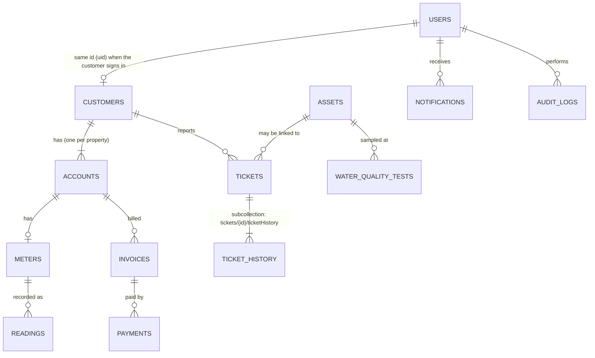

# AquaLink data model

Cloud Firestore, 14 collections. TypeScript types for every collection live in
[`src/types/models.ts`](../src/types/models.ts); typed references in
[`src/services/firestore.ts`](../src/services/firestore.ts).

## Relationships

`outageNotices` stand alone and are matched to customers by `affectedAreas`.

## Collections

| Collection                        | Key fields                                                                                                                                                            | Written by                                                       |
| --------------------------------- | --------------------------------------------------------------------------------------------------------------------------------------------------------------------- | ---------------------------------------------------------------- |
| `users/{uid}`                     | displayName, email, phone, role (mirror of the custom claim)                                                                                                          | Registration; `setUserRole`                                      |
| `customers/{id}`                  | name, email, phone, address, area, accountIds                                                                                                                         | Call centre, admin                                               |
| `accounts/{id}`                   | accountNumber, customerId, meterId, balance, status, propertyAddress, area                                                                                            | Billing, admin                                                   |
| `meters/{id}`                     | meterNumber, accountId, customerId, status, lastReading, lastReadingDate                                                                                              | Billing, admin                                                   |
| `readings/{id}`                   | meterId, accountId, customerId, readingValue (kL, cumulative), readingDate, recordedBy                                                                                | Billing                                                          |
| `invoices/{id}`                   | invoiceNumber, accountId, customerId, billingPeriod, previous/current reading, consumption, tariffRate, amount, status, dueDate, paidAt                               | Billing Cloud Function (`api/runBilling`, `api/generateInvoice`) |
| `payments/{id}`                   | invoiceId, accountId, customerId, amount, status, paymentMethod, reference, provider                                                                                  | Payment Cloud Function only                                      |
| `tickets/{id}`                    | ticketNumber, customerId, accountId, assetId, type, description, priority, status, location, area, customerName, assigned technician id + name, createdBy, resolvedAt | Customers, call centre, technicians                              |
| `tickets/{id}/ticketHistory/{id}` | fromStatus, toStatus, note, changedBy, changedByName                                                                                                                  | Append-only                                                      |
| `assets/{id}`                     | code, name, type, location, area, status, description                                                                                                                 | Asset manager                                                    |
| `waterQualityTests/{id}`          | assetId, assetName, sampleDate, parameter, result, unit, acceptableMin/Max, status                                                                                    | Water quality                                                    |
| `notifications/{id}`              | userId, title, message, type, relatedId, link, read                                                                                                                   | Server-side (Phase 12)                                           |
| `outageNotices/{id}`              | title, description, affectedAreas[], startTime, expectedResolution, severity, status                                                                                  | Communications                                                   |
| `settings/billing`                | tariffRate (rand per kL), paymentTermsDays, updatedAt, updatedBy                                                                                                      | Administrators                                                   |
| `auditLogs/{id}`                  | userId, userName, userRole, action, entity, entityId, details, timestamp                                                                                              | Server-side only                                                 |

## Design decisions

**Ownership is copied onto records (denormalised).** Accounts, meters, readings, invoices, payments and
tickets all carry `customerId`. Security rules can then check `resource.data.customerId == request.auth.uid`
without extra reads, and the customer portal can query "my invoices" directly.

**A signed-in customer's `customers` document ID is their Auth uid.** This makes the ownership check a
simple equality. Customers created by staff before they register get a generated ID; linking an existing
customer to a new login is handled when the customer portal is built (Phase 17).

**Display names are copied where lists need them.** Tickets store `customerName`, `location` and
`assignedTechnicianName`; water tests store `assetName`; audit logs store `userName`. Technicians can't
read customer records at all, so the ticket itself must say where the job is.

**Ticket history is a subcollection.** `tickets/{id}/ticketHistory` lets the rules check access against the
parent ticket. Reassigning a ticket therefore gives the new technician its whole history, with no copied
fields to keep in sync.

**Readings are cumulative.** A meter's value only goes up; consumption = current − previous
(`calculateConsumption` in `src/utils/domain.ts`). `meters.lastReading` is a copy for quick display.

**Invoices keep their own numbers.** Previous/current reading, consumption and `tariffRate` are stored on
each invoice, so old invoices stay correct if the tariff changes.

**Units.** Money in rand (2 decimals via `roundMoney`); water in kilolitres (kL); dates as Firestore
Timestamps; billing periods as `"YYYY-MM"` text so they sort and filter correctly.

**Reference numbers** (`TKT-260923-7F3K`) come from `generateReference`: date plus 4 characters that can't be
confused when read over the phone (no 0/O or 1/I/L). No shared counter document is needed.

**Water-quality limits** default to SANS 241 values in `WATER_QUALITY_PARAMETERS`. Each test stores the
limits it was judged against. Confirm the exact values with Silulumanzi before relying on them.

## Queries and indexes

Composite indexes are in [`firestore.indexes.json`](../firestore.indexes.json). Deploy with
`firebase deploy --only firestore:indexes`. Single-field indexes are automatic.

| Screen (phase)         | Query                                                      | Index                                        |
| ---------------------- | ---------------------------------------------------------- | -------------------------------------------- |
| My bills (10, 17)      | invoices where customerId == me, newest first              | customerId + createdAt↓                      |
| Account detail (7)     | invoices / payments / readings for one account             | accountId + createdAt↓ / readingDate↓        |
| Overdue run (10)       | invoices where status == UNPAID by due date                | status + dueDate                             |
| My payments (11)       | payments where customerId == me                            | customerId + createdAt↓                      |
| Usage chart (9, 17)    | readings for a meter or customer by date                   | meterId / customerId + readingDate↓          |
| My tickets (8, 17)     | tickets where customerId == me                             | customerId + createdAt↓                      |
| Ticket queue (8)       | tickets where status == X                                  | status + createdAt↓                          |
| My jobs (8)            | tickets where assignedTechnicianId == me [and status == X] | assignedTechnicianId (+ status) + updatedAt↓ |
| Assets (15)            | assets by type or area, by name                            | type / area + name                           |
| Customers (7)          | customers in an area, by name                              | area + name                                  |
| Water quality (14)     | tests for an asset / all ALERTs, newest first              | assetId / status + sampleDate↓               |
| Notification bell (12) | notifications for me [unread], newest first                | userId (+ read) + createdAt↓                 |
| Outages (16, 17)       | notices by status / for my area, by start                  | status / affectedAreas + startTime↓          |
| Audit log (18)         | logs for an entity / user, newest first                    | entity / userId + timestamp↓                 |

## Sample data

`npm run seed:sample -- --dry-run` builds and checks a small linked dataset (3 customers, every
collection) without writing. With `--key <service-account.json>` it writes it. Documents use fixed
`sample-…` IDs, so re-running overwrites rather than duplicates. Phase 20 expands this to the full demo set.
